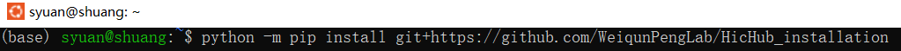
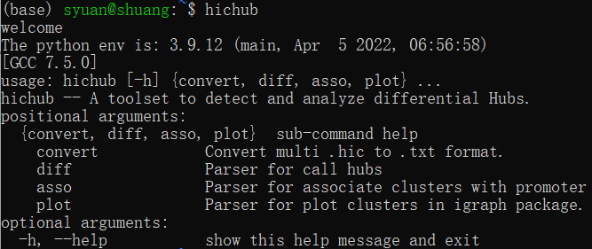
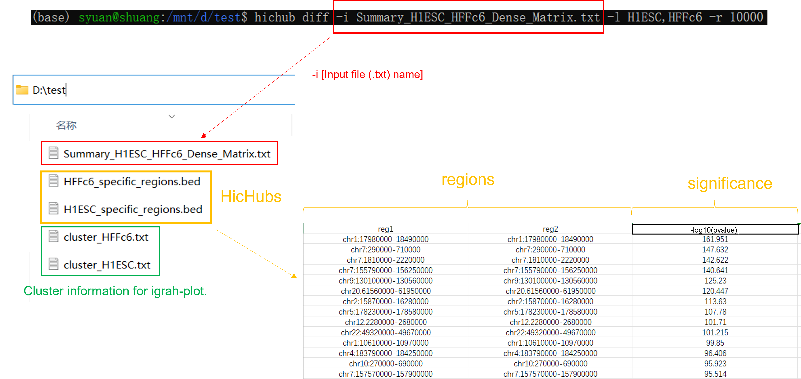

Latest updated on 07/09/2022,

# Comprehensive Network Analysis for HiC

<br>

<br>

- [Overview](#overview)
- [System Requirements](#system-requirements)
- [Installation Guide](#installation-guide)
- [Example of Running](#Example_Running)
- [License](#license)

## Overview
This module is a Python package containing tool for network analysis of differential interactions of Hic data.  

### Hardware Requirements

This package requires only a standard computer with enough RAM to support the in-memory operations.

### Software Requirements

We strong recommand you to install Anaconda before install HicHub. 
HicHub mainly depends on the Python scientific stack.  

```
python >=3
pandas
numpy
pybedtools
python-igraph
scipy
hic-straw
statsmodels
```

## Installation Guide
Before install HicHub, make sure you install following packages:
```
pip install hic-straw
```
```
pip install pybedtools
```
```
pip install scipy
```

Quick installation. Please type the following command in your Linux shell to install HicHub.

```
python -m pip install git+https://github.com/WeiqunPengLab/HiCHub
```

  

If installing successfully, type

```
hichub
```

in your Linux shell, then you will see the following interface:

```
welcome
The python env is: [your python version] (main, [time you type this command])
[GCC 7.5.0]
usage: hichub [-h] {convert, diff, asso, plot} ...
hichub -- A toolset to detect and analyze differential Hubs.
positional arguments:
  {convert, diff, asso, plot}  sub-command help
    convert            Convert multi .hic to .txt format.
    diff               Parser for call hubs
    asso               Parser for associate clusters with promoter
    plot               Parser for plot clusters in igraph package.
optional arguments:
  -h, --help           show this help message and exit
```


  
## Example of Runing

In order to call HicHubs, you first need to prepare two (.hic) files and put them in the same directory.  
In this Github, under the directory '~/test' there are two (.hic) files named 'H1ESC.hic' and 'HFFc6.hic'.  
You can download them for test.  
  
ATTENTION: You need to run all these process in the same directory, once you finished one step, please don't change the name of output files!  
  
### 'convert'
First, you need to use 'convert' command to convert them to (.txt) format that we will use,

```
hichub convert -i [run path] -f [file names, seperate with ','] -l [label of output, seperate with ','] -r [resolution of bin]
```
 -i : Your input path, the directory that you strore your two (.hic) files, the directory that you run the HicHub program.  
 -f : Your input file names, seperate them with comma. For example '-f H1ESC.hic,HFFc6.hic'.  
 -l : Your output files' labels, name your two input files with the same order, seperate them with comma. For example '-l H1ESC,HFFc6'.  
 -r : The length for one bin on genome , the unit is 'bp'. For example '-r 10000'.  

For example:

```
hichub convert -i /mnt/d/test -f H1ESC.hic,HFFc6.hic -l H1ESC,HFFc6 -r 10000
```

The output is a (.txt) format files which contains the contact matrics of two (.hic) files in the format:  
  
#chr    bin1    bin2    label1    label2.  

For example: #chr    bin1    bin2    H1ESC    HFFc6  
  
Where, '#chr', 'bin1', 'bin2' represent the chromosome, the location of the left anchor and the location of the right anchor respectivly. 
  

  
### 'diff'  
When you converted two (.hic) files into the (.txt) format by command 'convert', you can use command 'diff' to call hubs.

```
hichub diff -i [yout (.txt) file's name] -l [label you have used before] -r [resolution of bin] -c [optional, cut-off threshold] -d [optional, folde change threshold] -p [optional, p-value threshold]
```
 -i : Your converted (.txt) file's name from the 'convert' step. For example: '-i Summary_H1ESC_HFFc6_Dense_Matrix.txt'  
 -l : The labe you have used in the 'convert' step. For example: '-l H1ESC,HFFc6'  
 -r : The resolution you have used in the 'convert' step. For example: '-r 10000'  
 -c : Optional default = 10, remove the sum of two values of contact matric samller than a threshold. For example: '-c 10'.  
 -d : Optional default = 1.0, the threshold to determine whether we keep an edge in cluster analysis, the details could be seen in the paper.  
 -p : Optional default = 0.00001, The threshold to pick hubs smaller than a certain p-value.  

For example:
```
hichub diff -i Summary_H1ESC_HFFc6_Dense_Matrix.txt -l H1ESC,HFFc6 -r 10000
```
```
hichub diff -i Summary_H1ESC_HFFc6_Dense_Matrix.txt -l H1ESC,HFFc6 -r 10000 -c 10 -d 1 -p 0.00001
```
There are four output files.    
(1) --- 'H1ESC_specific_hubs.bed'  
(2) --- 'HFFc6_specific_hubs.bed'  
(3) --- 'cluster_H1ESC.txt'  
(4) --- 'cluster_HFFc6.txt'

(1) and (2) contain the cell-type-specific hubs we found.   
Format: left_hub_anchor ---- right_hub_anchor ---- -log10(pvalue)  

  
(3) and (4) record the cluster information we used to call hubs, they are use for drawing the network plot in the following functions.  
  

  
### 'asso'
This function associate genome annotation (gene, open chromatin) with network clusters. 
  
In the '~/test' folder, there are also two test files named 'promoter.bed' and 'DNase.bed' containing the information of gene promoter and DNase for the test data.  
  
```
hichub  asso -i [run path] -l [label you have used before] -p [the files contain gene promoter] -f [Optional, file name for DNase, CTCF, ...]
```
 -i : Your input path,the directory that you run the HicHub program. For example: '-i /mnt/d/test'  
 -l : The labe you have used in the 'convert' and 'diff' step. For example: '-l H1ESC,HFFc6'  
 -p : The name of the file that contains gene promoter's information.    
      The input format should be : #chr----start----end----gene_name, the program uses the start to determine     
      It contains the coordinate and name of the genes you want to analize and plot in the future.  '----' denotes a Tab.   
 -f : Optional. The name of the file that contains information about another factor, such as DNase, CTCF ....
      The input format should be : #chr----start----end----label1----label2----logFC  
  
For example:  
```
hichub asso -i /mnt/d/test -l H1ESC,HFFc6 -p promoter.bed
```
```
hichub asso -i /mnt/d/test -l H1ESC,HFFc6 -p promoter.bed -f DNase.bed
```
The ouput is the files with name "cluster_annotated_H1ESC.txt" and "cluster_annotated_H1ESC.txt". They associate the gene with the cluster nodes.
  

  
### 'plot'
This function plots the networks associated with one or more particular gene(s) along with the annotation information.

```
hichub plot -i [yout (.txt) file's name] -l [label you have used before] -p [the files contain gene promoter] -n [gene name] -c [optional, cut-off threshold you have used in 'diff'] -d [optional, folde change threshold you have used in 'diff'] 
```
 -i : Your converted (.txt) file's name from the 'convert' step. For example: '-i Summary_H1ESC_HFFc6_Dense_Matrix.txt'  
 -l : The labe you have used in the 'convert', 'diff', 'asso' steps. For example: '-l H1ESC,HFFc6'  
 -p : The file name that contain gene promoter's information.    
      The input format should be : #chr----start----end----gene_name   
 -n : The gene name you want to plot. For example: '-n LOX'  
 
 -c : Optional default = 10. The -c value you have used in 'diff'.       
 -d : Optional default = 1.0. The -d value you have used in 'diff'.     
 
The result will contain the network plot for gene you entered.   
If this gene is not in any hub, you will received the hint that : 'The 'gene_name' does not exist in any hubs.'  
## Versioning

```
1.0.0
```

## Authors

* Xiang Li, Shuang Yuan, Shaoqi Zhu  

## License

#This project is licensed under the MIT License - see the [LICENSE.md](LICENSE.md) file for details
