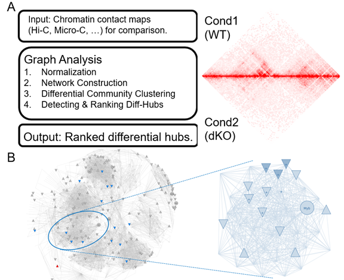

# NOTE: For Paper Review, please follow the instruction below:
Latest updated on 07/04/2021,

# Comprehensive Network Analysis for HiC


<br><br>

<br><br>


- [Overview](#overview)
- [Documentation](#documentation)
- [System Requirements](#system-requirements)
- [Installation Guide](#installation-guide)
- [Example of Running (Demo)](#Example_Running)
- [License](#license)

## Overview
This module is a Python package containing tool for network analysis of HiC data.
It starts from HiC Interaction pairs, then generating network and clustering. Finally ranking all clusters by their interaction change.

## System Requirements
### Hardware Requirements

This package requires only a standard computer with enough RAM to support the in-memory operations.

### Software Requirements

HicHub mainly depends on the Python scientific stack.

```
python >=3
pandas
numpy
pybedtools
python-igraph
scipy
```

## Installation Guide
Recommend to use bioconda for installing.
Create the environment from the environment_hichub.yml(Can be found in this repository) file:
```
conda env create -f environment_hichub.yml
python3 -m pip install hichub --user
python3 -m pip install numpy pandas pybedtools python-igraph scipy
```
```
https://bioconda.github.io/user/install.html
```

## Example of Running (Demo)
After installation, type hichub in your command line will return the following UI:
```
welcome
The python env is: 3.7.10 | packaged by conda-forge | (default, Feb 19 2021, 16:07:37)
[GCC 9.3.0]
usage: hichub [-h] [-v] {test,diff,convert} ...
hichub -- A toolset to detect and analyze differential Hubs
positional arguments:
  {test,diff,convert}  sub-command help
    test               Output for test parser
    diff               Parser for diff hubs
    convert            Convert multi .hic to txt format --> Format should be:
                       #chr bin1 bin2 Count
optional arguments:
  -h, --help           show this help message and exit
  -v, --version        show program's version number and exit
```

diff:
```
usage: hichub diff [-h] -i <file> -f <str> -b <str> -r <int> [-p <float>] [-t <int>]
hichub diff --help 
Input Format: HiC Interaction in txt format. Example of test data can be found in ~/test_data
And the output can be found at working directory: 
(Demo output is: 354_DKO_na_WT_na_specific_regions.bed or 318_WT_na_DKO_na_specific_regions.bed)
```

convert:
%% Convert .hic to required input format
```
usage: hichub convert [-h] -i <file> [-n <str>] -f <str> -l <str> -r <int>

Exmaple of output: 
reg1    reg2    -log10(pvalue)
chr10:19570000-19850000 chr10:19570000-19850000 45.91186483627381
chr10:20860000-21060000 chr10:20860000-21060000 41.129022601906215
chr10:117030000-117140000       chr10:116870000-117010000       14.165
chr10:95130000-95290000 chr10:95130000-95290000 9.80623027538454
chr10:18970000-19160000 chr10:18970000-19160000 9.288099829570816
```


## Built With

## Contributing

Please read (https:xx) for details on our code of conduct, and the process for submitting pull requests to us.

## Versioning

## Authors

* *Xiang Li  

## Contributors
* Shuang Yuan
## License

#This project is licensed under the MIT License - see the [LICENSE.md](LICENSE.md) file for details

## Acknowledgments


